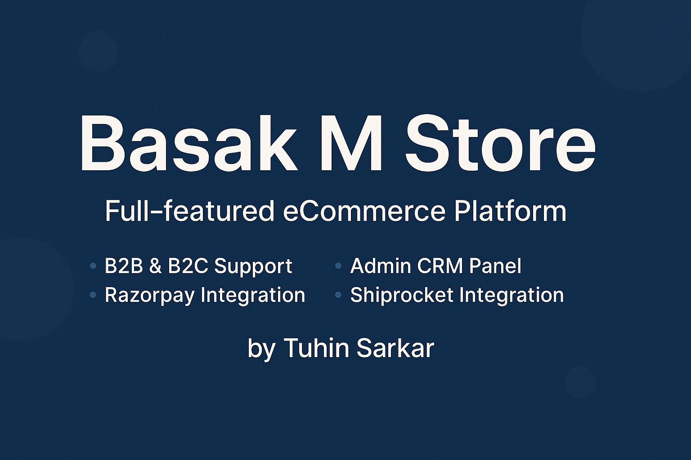

# 🛍️ Basak M Parts

One platform to run your entire online business — **B2B**, **B2C**, **Admin Control**, and **automated logistics**. From stock to shipping, handled with code.

---

## 🏆 Features

### 👥 B2B & B2C Storefront
- Product Listing, Search & Quick View
- Add to Cart, Update Cart, Remove Items
- Product Details & Receipts
- Responsive UI with jQuery + AJAX

### 🛒 Checkout System
- Razorpay Payment Gateway Integration
- Order Summary, Receipt Generation

### 🚚 Shiprocket Integration
- Auto Shipping Creation
- Order Tracking
- Cancel Orders Directly from Admin

### 🔧 Admin CRM Panel
- Manage Products, Orders, Users
- Website Control (like CMS)
- Dashboard Insights

---

## 💻 Tech Stack

| Tech         | Used For                     |
|--------------|------------------------------|
| PHP          | Backend                      |
| MySQL        | Database                     |
| JavaScript   | Interactions                 |
| jQuery + AJAX| Dynamic UI / Cart / Search   |
| Razorpay     | Payment Integration          |
| Shiprocket   | Shipping & Logistics         |

---

## 📁 Project Structure

basak-m-store/
├── b2b/          # B2B frontend (for wholesale clients)
├── b2c/          # B2C storefront (for regular customers)
├── admin/        # CRM & Admin Panel
├── includes/     # Configuration files (sample + actual)
├── database/     # SQL dump and database structure
├── assets/       # Static assets like images, JS, and CSS
├── README.md     # Project documentation
├── .gitignore    # Git ignore rules
├── cover.png     # Project cover image

---

## 👥 Contributors

  **Tuhin Sarkar** – Full Stack Developer 💻  

---

## 🌍 Live Website
  🔗 [**Basak M Parts**](https://basakmparts.com/)  
